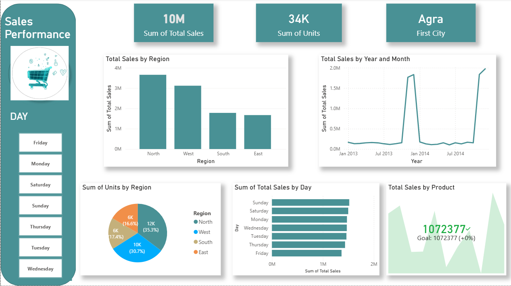

# sales-performance-dashboard
Sales performance dashboard developed using Power BI to provide a clear and interactive overview of sales metrics and trends.
# Sales Performance Dashboard

This is a dashboard developed using Power BI to share insights as part of my journey in data analytics. The dashboard provides a clear and interactive overview of sales performance, focusing on key metrics and trends to support better business insights.

## Dashboard Preview

## Dashboard Highlights
* 💰 **Total Sales:** 10M
* 📦 **Total Units Sold:** 34K
* 🌍 **Sales Analysis by Region**
* 📅 **Sales Trends by Year and Month**
* 📊 **Sales Performance by Day of the Week**
* 🎯 **Performance Tracking against defined sales targets**

## This dashboard helps to:
- [x] Monitor overall sales performance
- [x] Identify top-performing regions and time periods
- [x] Support data-driven business decision-making
